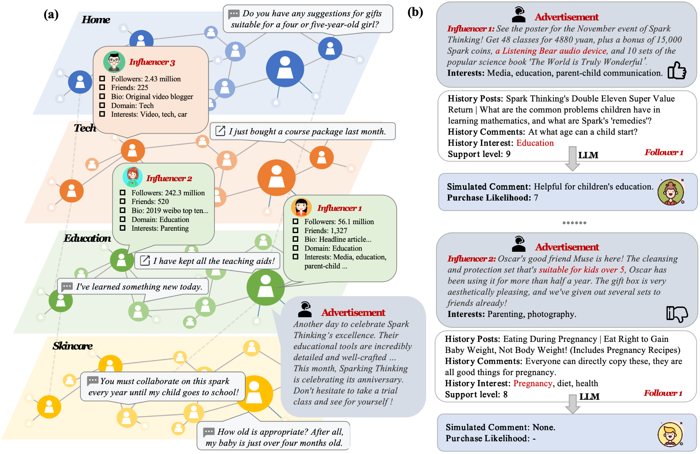
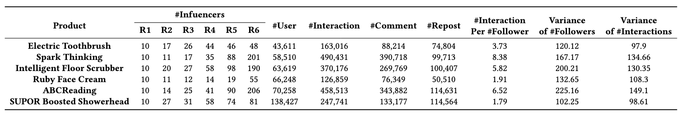
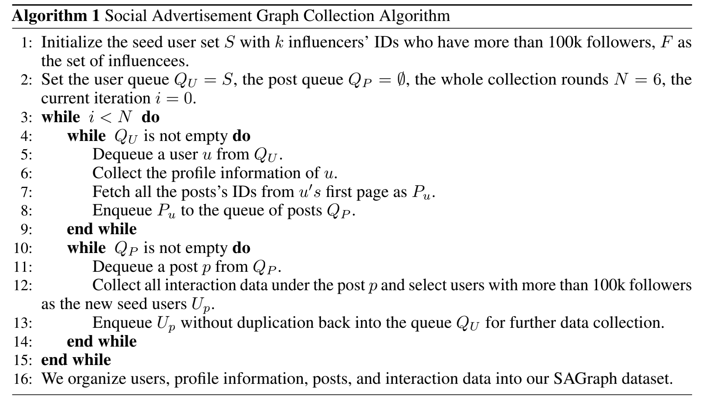
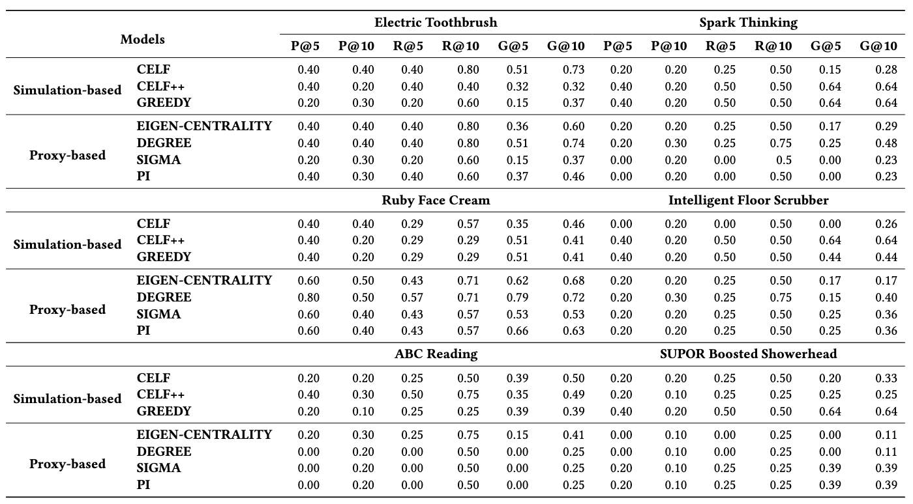
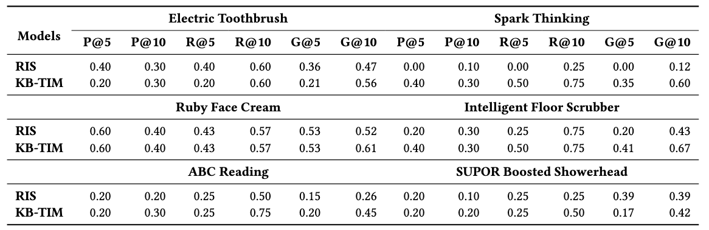
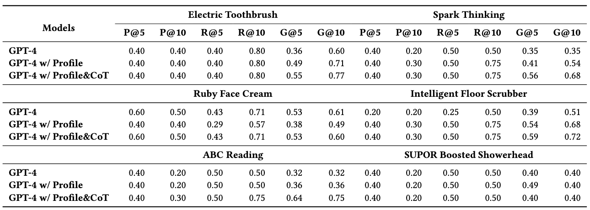

# SAGraph

## SAGraph: A Large-Scale Social Graph Dataset with
Comprehensive Context for Influencer Selection in Marketing

SAGraph is the largest-ever text-rich data for social advertising campaigns. It consists of 345,039 users, each with their profile information, the original ad copy, and interaction data including 1,302,109 comments and 554,629 reposts across 44,182 posts. With the rich interaction and textual content, one can gain deeper insights into consumer behavior, refine influencer selection criteria, and develop more targeted and effective marketing strategies. We evaluated existing influencer selection baselines and the latest LLMs on this dataset, demonstrating the importance of textual content in advertising campaigns and the potential of LLMs for enhancing advertising strategies.

Figure: (a) An example image of SAGraph that includes users, profile information, ads, and interaction data. (b) The comparison of influencers under the simulation of LLMs.

# Quickstart

#### step1: Install libraries;

pip install -r requirements.txt

#### step2: data collection;

cd data_collection;

1、prepare and init redis for storage;

Download the redis stack from https://redis.io/downloads/;

cd ./redis-stack-server-7.2.0-v6.catalina.x86_64

./redis-server

./redis-cli

python init_redis.py

2、collect user profile and user posts;

python weibo_list_spider.py

3、collect interaction data;

python weibo_detail_spider.py

4、data anonymize;

python data_anonymous.py

#### step3：selection and simulation;

cd llm_simulation;

Download dataset from [here](https://drive.google.com/drive/folders/1_JkyudTJcrrduKx8_G87PocSVSISUZK-?usp=drive_link).

1、pre-selection with the RandomForest;

python influencer_selection.py

2、simulate user behavior with GPT-4/GPT-4 profile/GPT-4 profile&CoT;

python influencer_prediction.py

#### step4: evalulate the baselines;

cd evaluation;

python evaluate.py eval_type; (classic or llm)

# Dataset Information

The product information , profile data of each user and interaction data under the posts are listed [here](https://drive.google.com/drive/folders/1_JkyudTJcrrduKx8_G87PocSVSISUZK-?usp=drive_link).

1、Ads information

- product_name: spark_thinking
- domain: education
- ads: Check out the poster for Spark Thinking's November event! Get 48 classes for just 4,880 yuan, plus 15,000 Huohua coins, a Tingli Xiong audio machine, and 10 sets of the popular science book *The World Is Really Wonderful*. Simply long press and scan the QR code to purchase now!\nWe've been giving away corn for several months, but this time we've switched things up with a new gift.\nThe PR team gently reminded me: "Are you always giving away corn? Won't people get tired of it?" [Not Simple] [Not Simple]\nThis time, we’re giving away a set of popular science books! Anyone who purchases the course in November will receive a set of these books!\nAnd if you still prefer corn, feel free to contact me privately to swap the gift.
- influencer_ids: 162395, 172251, 177999, 171351, 163119

2、User infomation;

product_name_profile.jsonl, here is a formatted introduction of the provided user profiles:

User 1:

- User ID: 1
- Username: user_1
- Followers Count: 637,140
- Friends Count: 388
- User Interests: [Beauty, Makeup, Skincare Products, Makeup Tools, Skincare Routine, Beauty Product Recommendations, Beauty V-Log Awards, Beauty Product Sharing, Lipstick, Blush, Concealer, Contouring, Lip Makeup, Winter Skincare, Night Skincare for Late-Nighters, Beauty Staple]
- User Description: Makeup enthusiast, with a mixed oily and acne-prone skin type in North China. For collaboration, please private message and specify the brand and product. No interest in working with direct sales brands, lingerie, weight loss products, or commission-only offers. Thank you～

User2:

- User ID: 19824
- Username: user_19824
- Followers Count: 55
- Friends Count: 388
- User Interests: [Finance, Investment, Part-time Jobs, Work]
- User Description: Determined to get rich quickly!

3、Interaction data;

Each record in the dataset is linked to a unique user identifier and includes the following information, encompassing all interaction details related to the aforementioned user and their post:

1. `text_raw`: This field contains the original text of the user's post.
2. `text_comment`: This field includes the actual comment made by the influencee.
3. `interact_type`: This field indicates the type of interaction, which includes "comment" and "reposts".
4. `interact_id`: This is a unique identifier for the interaction, linking related influencee.

Here is an example of the dataset:

- Interaction ID: 55540
  - Comment 1:
    - Raw Text: "Want to buy Armani Blue Label, not sure how it is."
    - Comment: "Although I don't have many blemishes on my face, I sweat easily, and I really feel like I've gone silly. I've been wearing makeup all day for nothing. You can try it at the counter, but after five minutes, if you don't set it, it will oxidize and show you clearly."
    - Interact_type: "comment"
    - Interact_id: 55391
  - Comment 2:
    - Raw Text: "Want to buy Armani Blue Label, not sure how it is."
    - Comment: "Please don't buy it, it's a tax on intelligence, really."
    - Interact_type: "comment"
    - Interact_id: 55391

# Data Construction

The implementation of the data collection are located in `data_collection` folder on Github.

# Baseline Models

Seven different baseline models were created:

- simulation-based
  - CELF
  - CELF++
  - GREEDY
- proxy-based
  - EIGEN-CENTRALITY
  - DEGREE
  - SIGMA
  - PI
- sketch-based
  - RIS
- context-based
  - KB-TIM
- LLM-based
  - GPT-4
  - GPT-4 w/ profile
  - GPT-4 w/ profile&CoT

Based on the [XFlow](https://github.com/XGraph-Team/XFlow) project, we have introduced the pre-selection process to implement the classical baselines such as CELF, CELF++, SIGMA, PI, and etc. Other LLM-based baselines can be found in the `llm_simulation` directory.

# Evaluation

Three different evaluation metrics were caculated:

1. Precision(P@k)

2. Recall(R@k)

3. Normalized Discounted Cumulative Gain(G@k)

Evaluation and comparison of the different baselines are found in `evaluation` folder on Github. 

The performance of six products for each baseline model for all metrics is shown below:

# Acknowledgement

Our code of evaluation for the classic influencer selection baselines are based on previous work:

- [XFlow](https://github.com/XGraph-Team/XFlow)

# Questions?

If you have questions, please raise an [issue](https://github.com/xiaoqzhwhu/SAGraph/issues).

