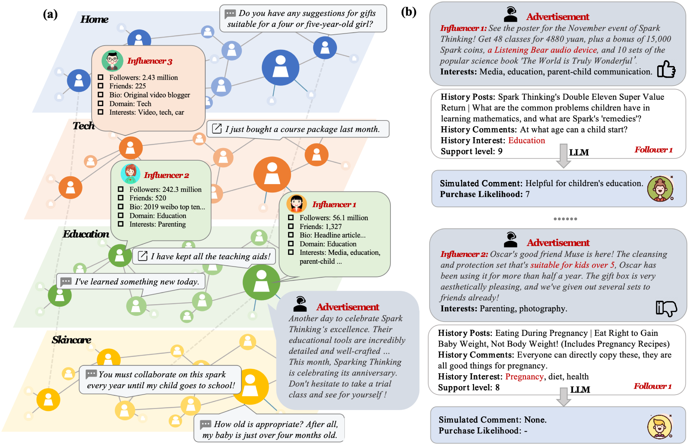
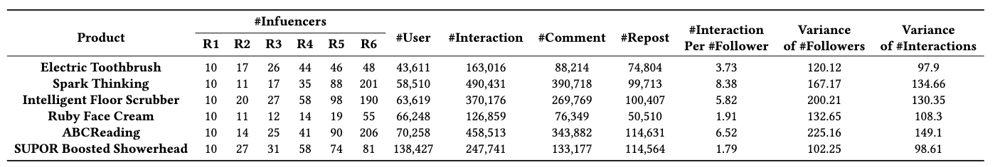
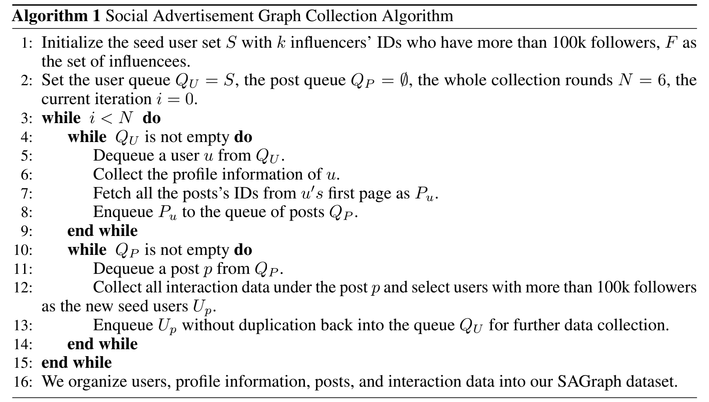
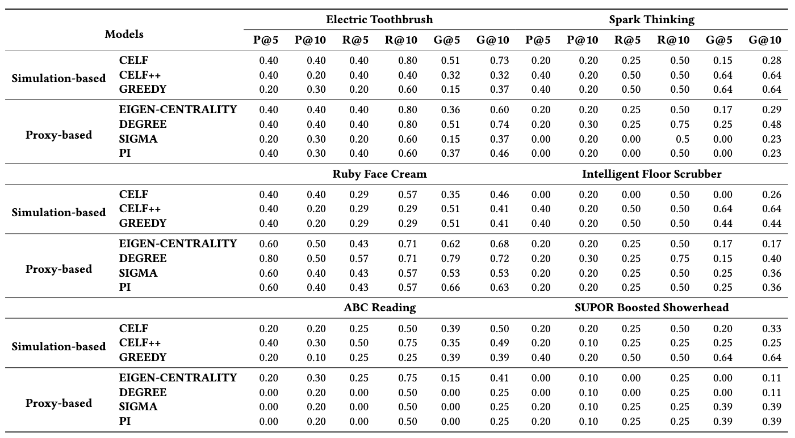

# SAGraph

## SAGraph: A Text-Rich Large Social Advertisement Graph Dataset for Advertising Campaigns
SAGraph is the largest-ever text-rich data for social advertising campaigns. It consists of 317,287 users, each with their profile information, the original ad copy, and interaction data including 891,834 comments and 441,836 reposts. With the rich interaction and textual content, one can gain deeper insights into consumer behavior, refine influencer selection criteria, and develop more targeted and effective marketing strategies. We evaluated existing influencer selection baselines and the latest LLMs on this dataset, demonstrating the importance of textual content in advertising campaigns and the potential of LLMs for enhancing advertising strategies.

Figure: (a) An example image of SAGraph that includes users, profile information, ads, and interaction data. (b) The comparison of influencers under the simulation of LLMs.

# Quickstart

#### step1: Install libraries;

pip install -r requirements.txt

#### step2: data collection;

cd data_collection;

1、prepare and init redis for storage;

cd ./redis-stack-server-7.2.0-v6.catalina.x86_64

./redis-server

./redis-cli

python init_redis.py

2、collect user profile and user posts;

python weibo_list_spider.py

3、collect interaction data;

python weibo_detail_spider.py

#### step3：selection and simulation;

cd llm_simulation;

1、pre-selection with the RandomForest;

python influencer_selection.py

2、simulate user behavior with GPT-4/GPT-4 profile/GPT-4 profile&CoT;

python influencer_prediction.py

#### step4: evalulate the baselines;

cd evaluation;

python evaluate.py eval_type; (classic or llm)

# Dataset Information

The product information , profile data of each user and interaction data under the posts are listed [here](https://drive.google.com/drive/folders/1up7Fo6HZ0fJOKIWA3vTMwRn-cLyDOrS4?usp=drive_link).

# Data Construction

The implementation of the data collection are located in `data_collection` folder on Github.

# Baseline Models

Seven different baseline models were created:

1. CELF
2. CELF++
3. SIGMA
4. PI
5. GPT-4
6. GPT-4 w/ profile
7. GPT-4 w/ profile&CoT

Based on the [XFlow](https://github.com/XGraph-Team/XFlow) project, we have introduced the pre-selection process to implement the baselines CELF, CELF++, SIGMA, and PI. Other LLM-based baselines can be found in the `llm_simulation` directory.

# Evaluation

Three different evaluation metrics were caculated:

1. Precision(P@k)

2. Recall(R@k)

3. Normalized Discounted Cumulative Gain(G@k)

Evaluation and comparison of the different baselines are found in `evaluation` folder on Github. 

The performance of six products for each baseline model for all metrics is shown below:

# Acknowledgement

Our code of evaluation for the classic influencer selection baselines are based on previous work:

- [XFlow](https://github.com/XGraph-Team/XFlow)

# Questions?

If you have questions, please raise an [issue](https://github.com/xiaoqzhwhu/SAGraph/issues).

